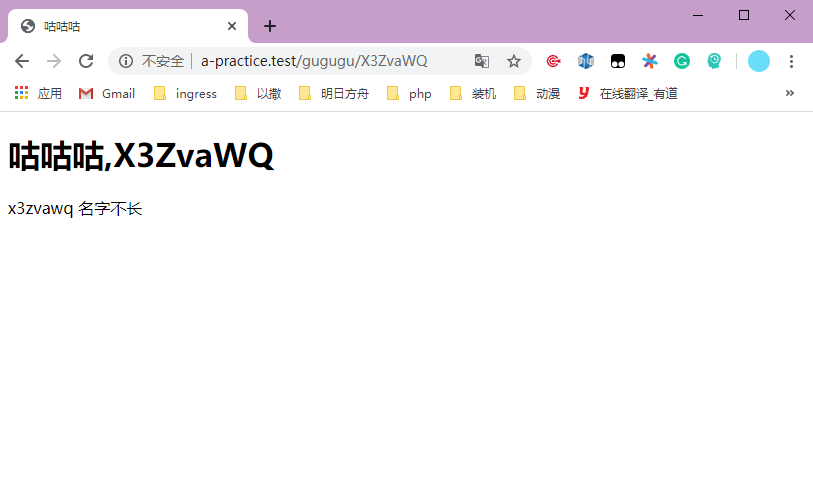
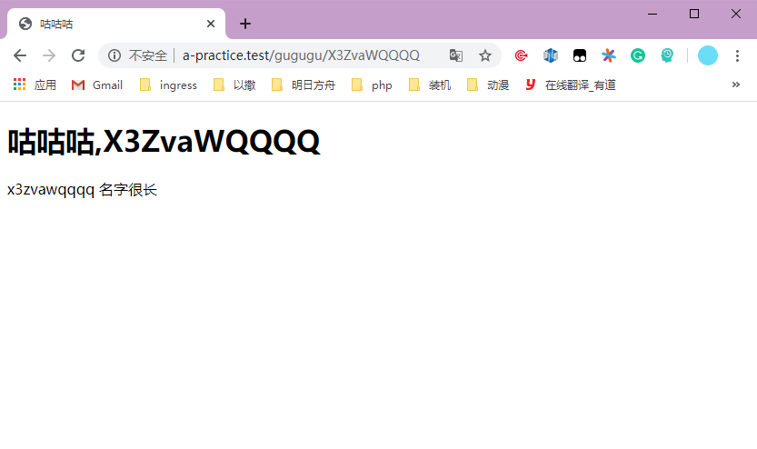

# laravel的view

写于2020年1月29日 13点03分

这篇文章主要针对的是前后端不分离，也就是一个laravel项目里既包含前端页面也包括后端处理的项目。

所谓的MVC，上一篇文章其实大概只讲了C，Model因为暂时没用到所以我就忽略了，然后这一次的小目标并不涉及Model，但是有一个是涉及view的。

所以大概讲讲laravel的view是个啥。唔，从MVC说起吧。

还记不记得我们以前写的php代码，我们一般会在开头获取一些需要用的数据，然后开始写html代码来形成网页，比如这样：

```php+HTML
<?php
    $user = $_GET['user'];
?>
<!DOCTYPE html>
<html lang="en">
<head>
    <meta charset="UTF-8">
    <meta name="viewport" content="width=device-width, initial-scale=1.0">
    <title>Hello</title>
</head>
<body>
    <h1>
    	Hello, <?php echo $user; ?>
    </h1>
</body>
</html>
```

因为功能比较简单，所以这么写并没有什么大问题，但是如果功能复杂了，需要的数据多了，涉及到数据库了等让程序变得复杂了，开头的那段以及后面插在html里面的`<?php` 和`?>`就显得有些臃肿。

这个时候我们是怎么操作的？我们把获取数据的处理数据的尽量不要放在html有关的部分里，MVC三个部分能放在哪个部分呢？没错就是`Controller`，但是根据又根据另外一个原则叫做单一责任原则，`Controller`只负责处理请求，所以跟数据有关的应该交给另外的一个层，我们一般叫做`Service`层，但是这个比较复杂，我们这里就写在`Controller`里，又回到`Controller`的代码。

```php
public function index(Request $request) {
    return response()->view('hello');
}
```

向上面的代码，控制器向客户端返回了一个纯碎的视图(`view`)的响应，这一个视图里面并不包含任何的变量，只是一个普通的html页面，代码可以在项目根目录的`/resources/views/hello.blade.php`里面看到。

那么就像前面我说的，我们的目标是分离获取数据的过程和显示数据的过程，那么`Controller`里面获取数据，我们要怎么把数据传递给`View`呢？

不同于一开始的那个php的例子，因为声明和调用变量是在一个文件，也就是一个作用域内，所以可以直接调用，`laravel`的`view`如果需要调用变量需要我们手动把变量注入进去。

现在我们用`laravel`实现一开始那个`php`的例子实现的功能：

```php
//控制器controller部分
public function index(Request $request) {
    $user = $request->user;
    return response()->view('gugugu',[
        'user'=> $user
    ]);
}
```

```html
//视图view部分
<!DOCTYPE html>
<html lang="en">
<head>
    <meta charset="UTF-8">
    <meta name="viewport" content="width=device-width, initial-scale=1.0">
    <meta http-equiv="X-UA-Compatible" content="ie=edge">
    <title>咕咕咕</title>
</head>
<body>
<h1>
    咕咕咕,{{ $user }}
</h1>
</body>
</html>
```

这里我新建了一个视图文件，叫`gugugu.blade.php`，laravel默认使用一种叫`blade`模板的东西来展示视图，像上面这个例子，我们在控制器里通过`view`这个方法指定了返回的视图的名称，这里我们给的第一个参数是`gugugu`，然后laravel会在`/resources/views/`这个目录里面去找`gugugu.blade.php`，如果没找到则会报错。

然后`view`的第二个参数的作用就是注入变量了，在这个例子里面我们传入的参数是一个php的关联数组：

```php
['user' => $user]
```

注意，这个关联数组的键是在`view`视图文件里面调用的变量，然后值是变量的值，这么说有些凌乱，直接说例子，如果我把这个关联数组写成这样：

```php
['uuuuser' => $user]
```

那么我们在视图里面就应该这么调用变量

```html
咕咕咕,{{ $uuuuser }}
```

`{{}}`的作用不仅是展示变量，你也可以在里面写一些`php`的表达式，然后`blade`模板会帮你把那个表达式计算并且表示出来，比如`{{ strtolower($user) }}`，当然我们一般并不建议这么干，我们更推荐的是把所有处理数据的过程全部丢给`Controller`或者职责更加明确的另一层面的东西，这里暂且不论。

然后`blade`也支持更多的操作，比如逻辑结构：

```html
@if(strlen($user) > 8)
	名字很长
@else
	名字不长
@endif
```

这样当传入的用户名长度大于8会显示名字很长，否则显示名字不长。

同样的也支持`foreach`这样的操作。

更多的操作可以查看官方文档的`blade`模板一文：https://learnku.com/docs/laravel/6.x/blade/5147

对了，前面的例子写好了，还没实践一番呢，现在的代码是这样的：

```php
//路由 web.php
Route::get('/gugugu/{user}','HomeController@gugugu')
```

```php
//控制器 HomeController.php
<?php
namespace App\Http\Controllers;

use Illuminate\Http\Request;

class HomeController extends Controller
{
	...
    public function gugugu(Request $request) {
        $user = $request->user;
        return response()->view('gugugu',[
            'user' => $user
        ]);
    }
}
```

```html
//视图 /resources/views/gugugu.blade.php
<!DOCTYPE html>
<html lang="en">
<head>
    <meta charset="UTF-8">
    <meta name="viewport" content="width=device-width, initial-scale=1.0">
    <meta http-equiv="X-UA-Compatible" content="ie=edge">
    <title>咕咕咕</title>
</head>
<body>
<h1>
    咕咕咕,{{ $user }}  
</h1>
    {{strtolower($user)}}
    @if(strlen($user) > 8)
        名字很长
    @else
        名字不长
    @endif
</body>
</html>
```



