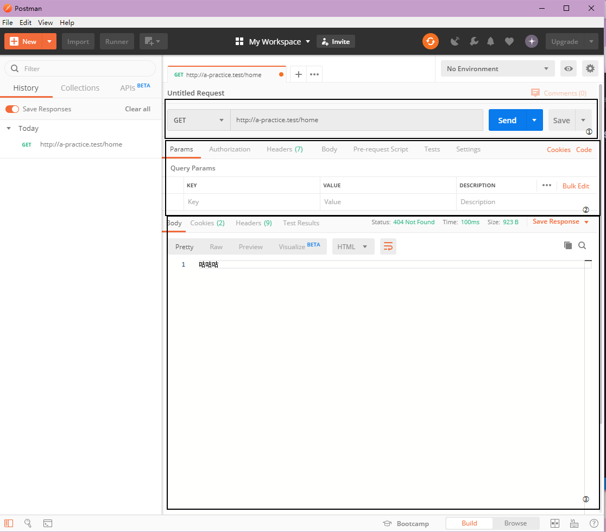

大部分的调试都可以使用浏览器直接访问对应的url去完成

但是有一些http请求不能单纯的通过浏览器发

这个时候就可以了解一个叫postman的工具

这个工具可以用于测试一个web应用的api工作是否正常 返回数据是否符合预期什么的

大概界面如下，然后我们主要用到的会是右边的部分，如图三个框框右下角有标号

其中①部分我们可以用来选择请求方式，postman支持的请求方式十分得多(x 常用的大概有GET/POST两种方式

然后就是url，如图所示，则postman会向这个地址发起一个请求，相当于一个简单的浏览器

然后②部分我们可以填写参数，其中Params页是GET传值，Body(请求体)页是POST传值。

然后点击①中的Send后就可以在③中看到结果了。
