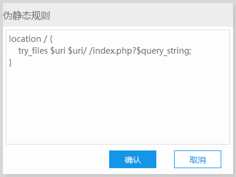

部署laravel需要准备的主要有

- php
- nginx
- composer
- mysql

使用新版本的phpStudy的话部署起来还是很轻松的

首先把mysql composer都安排上

首先需要做的是创建一个站点，或者直接把原来的路径改掉

> 一些注意事项(这里的内容会根据大家遇到的问题增加)：
>
> - **一般情况下，路径名不应该包含中文和空格。 对于空格而言，不管是linux还是windows的支持都并不是很好，比如phpstudy在处理有空格的目录就会报错。所以如果实在需要空格建议用杠(-)或下划线(_)替代。**
> - **一般情况下，域名也不应该含有中文，按照域名标准域名应该是全英文的，中文的域名实际上也会经过一个punycode转码，比如`咕咕咕.com`会被转换成`xn--9traa.com`,有兴趣的可以继续百度，所以在配置域名的时候请尽量不要使用中文域名**
> - **一般情况下，域名格式应该是`xxxx.xxx` 也可以是 `xxx.xxxx.xxx`,也可以有更多节，但是最好不要出现一节的，比如`hairless`，因为这样的域名虽然可以访问到，但是在涉及到cookies的存储的时候会炸。因为域名的最后一节是根域名，比如我们常见的`com`,`cn`,`org`，第二节才是主要的域名，比如`baidu.com`中的`baidu`。而只有一节的话相当于只有根域名，而cookie不能储存在根域名上。**

- 基本配置

  - 域名随意，但是按照规范建议使用`<项目名>.test`，比如ATSAST可以使用`atsast.test`
  - 第二域名同样随意，可以留空
  - 端口本地调试使用http 80端口即可
  - 根目录应该设置到laravel项目根目录的public目录下
  - 创建环境的话勾选同步hosts即可
  - php版本需要大于7.2

- 高级配置，安全配置，错误页面全都默认就好了

- 然后伪静态输入

  - ```nginx
    location / {
        try_files $uri $uri/ /index.php?$query_string;
    }
    ```
    **注意: 好像有时候会打开设置，伪静态规则会变成apache的规则，所以如果里面有东西的话直接覆盖即可，像这样：**  
      
    

然后域名的基本配置就可以了，然后需要开启一些php的扩展

在网站内，站点右边的管理，点开 php扩展

勾上一下几个扩展，如果已经勾上了不管就好了(x

- `php curl`
- `php_fileinfo`
- `php_gd2`
- `php_mbstring`
- `php_openssl` 
- `php_pdo_mysql`

对了，如果是clone过来的库的话，可能是没有.env文件的，这个是laravel的环境配置，但是一般都会有一个.env.example，我们需要做的是在**根目录**执行

```bash
cp .env.example .env
```

然后编辑创建出的.env文件，大致需要改的部分就是数据库，但是如果没有准备好数据库的话，可以先把

```
...

DB_CONNECTION=mysql
DB_HOST=127.0.0.1
DB_PORT=3306
...
```

中的`mysql`去掉，就是变成这个样子:

```
DB_CONNECTION=
```

然后到项目根目录下面

```bash
composer install
```

如果install的过程太慢可以换阿里的源。关于怎么换源zlb应该讲过了吧(x

完了之后在根目录执行

```
php artisan key:generate
```

以生成应用密钥，这个密钥会参与你的应用内的hash生成，验证等各种操作，所以如果迁移生产环境的话可能得保证两边的key是一样的(x

然后访问在phpstudy里面设定好的域名应该就能看到了吧(x


然后关于vscode的话，建议使用扩展


包含很多laravel项目常用的东西。